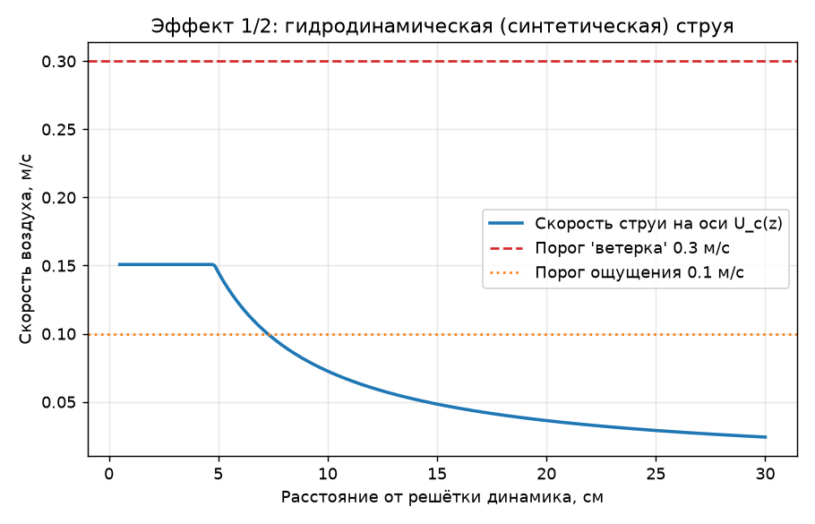
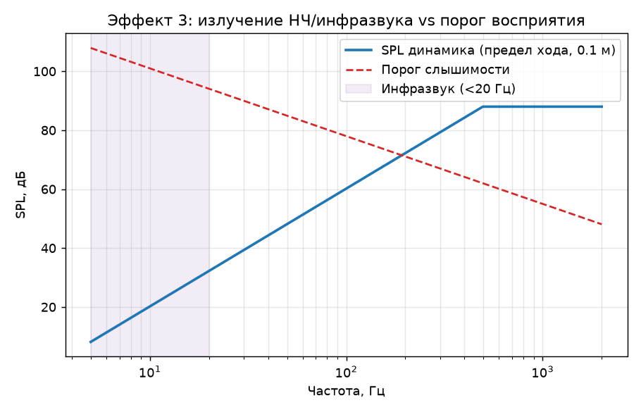
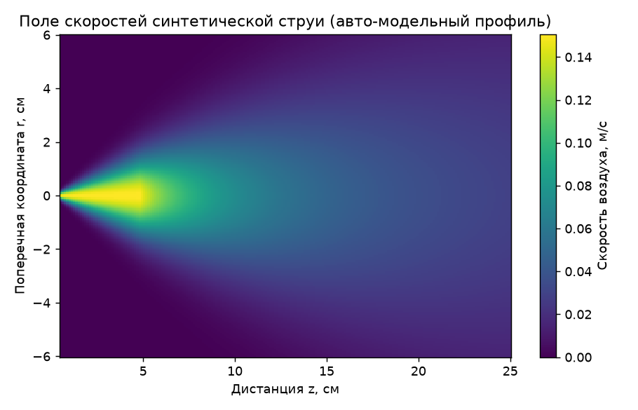

# gamepad_airfield

[](https://github.com/kiskaserver/gamepad_airfield/actions/workflows/ci.yml)
[](https://github.com/kiskaserver/gamepad_airfield/releases)


**Физическая симуляция «воздушных» эффектов микродинамика геймпада PS4/PS5**
(DualShock 4 / DualSense): лёгкий ветерок, гидродинамическая струя и
инфразвук / плотный низкочастотный гул.

---

## Аннотация

Может ли крошечный встроенный динамик геймпада создать ощущаемый поток воздуха
и инфразвук «по всем канонам физики»? Этот репозиторий отвечает на вопрос
количественно. Модель сознательно строится **от механического предела
излучателя** (ограничение по ходу диафрагмы), а не подгоняется под желаемый
результат, — поэтому числа получаются сами и служат честной проверкой гипотезы.

Рассматриваются три механизма:

1. **Synthetic jet** — направленная струя от колеблющейся диафрагмы (ветерок);
2. **Эккартовский streaming** — «кварцевый ветер» от поглощения звука;
3. **Излучение НЧ/инфразвука** — против порога слышимости и тактильного канала.

## Ключевые результаты

| Эффект | Механизм (физика) | Ощутимо у геймпада? | Канал |
|---|---|---|---|
| Лёгкий ветерок | synthetic jet | частично, вплотную к решётке | гидродинамика |
| Гидродинам. струя | momentum jet `M = ρ⟨u²⟩A` | механизм верен, амплитуды нет | гидродинамика |
| Инфразвук (воздух) | акустич. излучение | **нет** (дефицит ~62 дБ @ 20 Гц) | — |
| Низкочастотный гул | вибрация / хаптика | **да** | тактильно |

> **Вывод.** Физика поддерживает *механизмы* всех трёх эффектов, но при реальных
> размерах и ходе диафрагмы ощутимы лишь слабый поток вплотную к решётке и
> тактильный НЧ-гул — **и ни один не является воздушным звуком**. Полноценный
> «ветерок на лице» и воздушный инфразвук такой излучатель создать не может.
> Полный разбор и все формулы — в [`THEORY.md`](THEORY.md).

## Результаты в графиках

| Гидродинамическая струя | АЧХ и порог инфразвука | Поле скоростей струи |
|---|---|---|
|  |  |  |

## Методы (кратко)

- **Источник** — модель малого поршня/монополя, ограниченного по ходу:
  `p ~ ρ c k Q / (4π r)`, `Q = A ω x_max`. Это даёт физически корректный спад
  излучения **12 дБ/октаву** ниже резонанса — ключ к вопросу об инфразвуке.
- **Ветерок** — синтетическая струя: поток импульса `M = ρ⟨u²⟩A`, критерий
  формирования `L₀/D > 0.5`, расплывание турбулентной струи `U_c = B√(M/ρ)/z`.
- **Streaming** — объёмная сила Эккарта `F = 2αI/c` с поглощением воздуха по
  ISO 9613-1.
- **Восприятие** — пороги движения воздуха кожей (~0.1 м/с) и слышимости
  инфразвука (ISO 226 / Watanabe–Møller).

## Запуск

```powershell
# окружение уже создано в .venv
.\.venv\Scripts\python.exe simulate.py
```

Установка с нуля:

```powershell
python -m venv .venv
.\.venv\Scripts\python.exe -m pip install -r requirements.txt
.\.venv\Scripts\python.exe simulate.py
```

Результаты: консольный отчёт, графики `output/*.png` и числовая сводка
`output/results.json`.

Сборка PDF-отчёта (титул, аннотация, таблица, графики, литература):

```powershell
.\.venv\Scripts\python.exe report.py     # → output/report.pdf
```

📄 Готовый отчёт: [`output/report.pdf`](output/report.pdf).

## Воспроизводимость

- Точные версии окружения зафиксированы в [`requirements-lock.txt`](requirements-lock.txt).
- CI ([GitHub Actions](.github/workflows/ci.yml)) на каждый push прогоняет
  `simulate.py` и `report.py` на Python 3.11/3.12/3.13, проверяет наличие
  выходных файлов и публикует графики и PDF как артефакты сборки.
- Каждая версия результатов фиксируется
  [релизом](https://github.com/kiskaserver/gamepad_airfield/releases) (semver).

## Структура

| Файл | Назначение |
|---|---|
| `physics.py` | физическое ядро: акустика монополя, synthetic jet, streaming Эккарта, инфразвук |
| `simulate.py` | прогон модели, отчёт, графики, `results.json` |
| `report.py` | сборка академического PDF-отчёта (`output/report.pdf`) |
| `THEORY.md` | подробный разбор и вердикт по каждому эффекту |
| `output/` | графики (`*.png`), `results.json`, `report.pdf` |
| `CITATION.cff` | метаданные для цитирования |
| `requirements-lock.txt` | зафиксированное окружение для воспроизводимости |
| `.github/workflows/ci.yml` | CI: автопрогон модели и отчёта |

## Ссылки

1. Kinsler, Frey et al. *Fundamentals of Acoustics*, Wiley.
2. Glezer & Amitay. *Synthetic Jets*, Annu. Rev. Fluid Mech. 34 (2002).
3. Pope. *Turbulent Flows*, Cambridge Univ. Press (2000).
4. Eckart. *Vortices and Streams Caused by Sound Waves*, Phys. Rev. 73 (1948).
5. Lighthill. *Acoustic Streaming*, J. Sound Vib. 61 (1978).
6. ISO 9613-1 — поглощение звука в атмосфере; ISO 226 — кривые равной громкости.

## Цитирование

См. [`CITATION.cff`](CITATION.cff). GitHub автоматически формирует ссылку
«Cite this repository» в правой панели.

## Лицензия

[MIT](LICENSE) © 2026 Nikita Vinnik (kiskaserver)

> **Disclaimer.** Образовательная физическая модель порядка величины.
> Параметры динамика взяты по порядку величины и не являются официальной
> спецификацией Sony.
